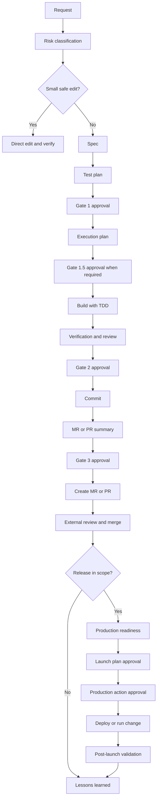
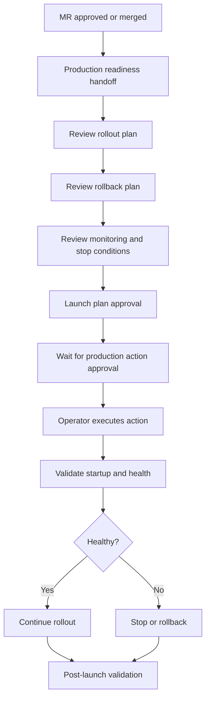

# ControlFlow Workflow State Machine

Human-readable reference for ControlFlow: a human-gated delivery workflow for
AI-assisted coding from request intake to production launch and lessons
learned.

This document explains the lifecycle, states, gates, and role expectations for
humans. Agent execution rules live in `skills/cf-state-machine/SKILL.md`.

## Purpose

ControlFlow keeps AI-assisted work auditable and reviewable. It prevents risky
code changes from moving forward without explicit human approval, and it keeps
test evidence, review evidence, MR readiness, and launch readiness visible.

Use this document to answer:

- Where are we in the workflow?
- What artifact should exist now?
- Who approves the next transition?
- What does each approval allow?
- When is production action allowed?

## Core Rules

- No risky implementation before approved spec, test plan, and visible
  execution plan.
- Failing tests come before code unless the task is documentation,
  formatting, config-only, or TDD is explicitly skipped.
- Every risky transition requires explicit human approval.
- MR creation and production action are separate approvals.
- Agent execution protocol is `cf-state-machine`; this file is the human
  reference.

## Roles

| Role | Responsibility |
|---|---|
| Agent | Routes work, drafts artifacts, runs safe checks, prepares handoffs |
| Developer | Owns implementation, tests, diff correctness, and fixes |
| Lead | Approves gates, scope, risk, MR creation, and launch readiness |
| Reviewer | Independently reviews code, tests, security, API, or launch risk |
| Operator | Executes production deploys, config changes, and runbooks |

One person may hold multiple roles in a small team, but the approval meanings
stay separate.

## Lane Classification

| Lane | Use When | Evidence | Review |
|---|---|---|---|
| Lane A | Low-risk docs, lint, small UI tweaks, mechanical refactors | Mechanical checks are enough | Same-model AI self-review may be enough |
| Lane B | Behavior, API/schema, auth/security, irreversible data work, data integrity, external integrations | Full spec, test plan, validation scenarios, stronger evidence | Independent reviewer required |

Lane B triggers are one-way. If one trigger applies, treat the work as Lane B.

## End-To-End Flow

## State Table

| State | Purpose | Main Artifact | Human Gate |
|---|---|---|---|
| Request | Capture user goal and constraints | Request summary | No |
| Risk Classification | Choose direct edit, mini-spec, or full workflow; assign lane | Routing decision | Sometimes |
| Spec | Define scope, behavior, acceptance criteria, risks | `docs/specs/<slug>.md` | Gate 1 |
| Test Plan | Define proof before implementation | `docs/specs/<slug>-tests.md` | Gate 1 |
| Execution Plan | Show implementation order and verification strategy | Visible plan in chat or handoff | Gate 1.5 when required |
| Build | Write failing tests, implement smallest correct change | Diff and tests | No |
| Verification | Run tests, validation scenarios, and review | Evidence summary | Gate 2 |
| Commit | Convert approved diff into commit history | Conventional commit(s) | Commit preview approval if required |
| MR Summary | Prepare review-ready MR or PR text | MR/PR title and body | Gate 3 |
| MR Created | Submit change to normal review system | MR/PR link | External review |
| Merge Readiness | Resolve review and confirm merge safety | Approved MR/PR | Project merge policy |
| Production Readiness | Prepare rollout, rollback, monitoring, validation | Launch handoff | Launch plan approval |
| Production Action | Execute real production step | Operator runbook/action | Explicit production action approval |
| Post-Launch Validation | Confirm health after rollout | Validation evidence | No |
| Lessons Learned | Capture workflow improvements | Notes or follow-up issues | No |

## Approval Gates

| Gate | Approval Means | Approval Does Not Mean |
|---|---|---|
| Gate 1: Spec + Test Plan | Scope and proof plan accepted | Code can merge, MR can be created, or production can change |
| Gate 1.5: Execution Plan | Planned implementation order is accepted | Diff is accepted |
| Gate 2: Reviewed Diff | Tested and reviewed code is accepted | MR can be created without Gate 3, or production can change |
| Gate 3: MR Summary | MR or PR may be created | MR is approved to merge, or production can change |
| Launch Plan Approval | Rollout/rollback/monitoring plan is accepted | Production action is authorized |
| Production Action Approval | Specific production action may proceed | Future production actions are automatically approved |

## Artifact Map

| Artifact | Location |
|---|---|
| Spec template | `templates/spec-template.md` |
| Test plan template | `templates/test-plan-template.md` |
| MR/PR template | `templates/mr-template.md` |
| Launch template | `templates/launch-template.md` |
| Agent execution protocol | `skills/cf-state-machine/SKILL.md` |
| Lane rules | `references/lane-classification.md` |
| Review checklist | `references/review-checklist.md` |
| Production checklist | `references/production-readiness-checklist.md` |

## Production Flow

## Practical Routing

| Situation | Path |
|---|---|
| Typo, small copy fix, trivial config value | Direct edit |
| Small behavior change with clear acceptance | Mini-spec |
| New feature, API/schema change, security/auth, data integrity | Full workflow |
| Vague or multi-path request | Brainstorming before spec |
| Bug with unknown root cause | Debugging before spec |
| Already-reviewed diff needing MR text | MR stage |
| Approved change needing rollout planning | Ship stage |

If two engineers could build different valid versions, use at least a
mini-spec. If wrong behavior could hurt users, data, security, or public
contracts, use full workflow.

## Agent Boundary

This document is intentionally optimized for humans. Agents should not load it
as operational context by default. Use these agent-facing sources instead:

- `skills/cf-intake/SKILL.md` for routing and lifecycle orchestration.
- `skills/cf-state-machine/SKILL.md` for executable state transitions.
- `templates/` for fillable artifacts.
- `references/` for reusable checklists.
