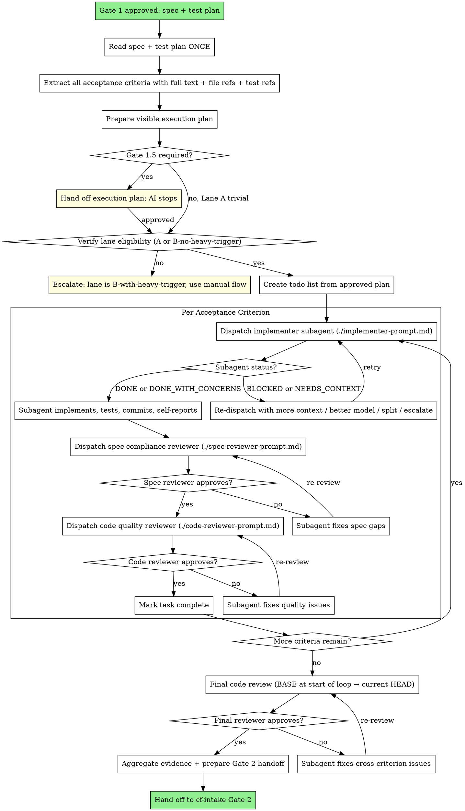

# Subagent Orchestration

## Overview

Execute an approved spec by dispatching a fresh subagent per approved
task or acceptance criterion, with lane-appropriate AI review per
criterion, and a final AI review across the whole diff when coupling or
lane risk requires it before handing off to Gate 2.

## Why Subagents

A coding agent session accumulates context: prior reads, prior decisions,
prior mistakes. Over a long spec, that context pollutes judgment. By
dispatching a fresh subagent per criterion with curated context, you get:

- Isolated context window per criterion (no accumulated drift)
- Pre-task questions surface before work begins, not after
- Lane-appropriate AI review catches issues before human review
- Final cross-criterion review catches inter-criterion issues when the
  criteria share interfaces, files, runtime behavior, or risk

The cost is more subagent invocations. The benefit is higher-quality
output and less rework at Gate 2.

## When To Use This Skill

Use this skill when **all** of these are true:

- Gate 1 (spec + test plan) is approved
- A visible execution plan exists before dispatch
- Gate 1.5 is approved when required: always for Lane B; for Lane A when
  non-trivial, multi-step, multi-file, multi-commit, subagent-eligible,
  or estimated above 30 minutes
- Spec has 3+ testable acceptance criteria, OR estimated effort is 45+
  minutes or more, OR explicit rationale shows isolated review reduces
  rework more than it repeats context
- Criteria are mostly independent (different files/packages, no shared
  mid-implementation state)
- Lane is A, OR Lane B without heavy trigger
- Total estimated effort justifies subagent overhead

## When NOT To Use This Skill

Do not use this skill when:

- Spec has 1 acceptance criterion (use manual flow)
- Lane A has 2 isolated acceptance criteria and no special review value
  (prefer manual flow)
- Required Gate 1.5 approval is missing
- Lane B with heavy trigger (use manual flow with external reviewer)
- Criteria are tightly coupled (one criterion's diff affects another's
  signature or interface mid-implementation) — split spec first or use
  manual flow
- Total estimated effort is < 45 minutes and no explicit review-isolation
  rationale exists (overhead exceeds benefit)

## Lane Eligibility

### Lane A — use this skill when overhead is justified

Documentation, config, lint fixes, internal refactors, observability,
well-understood mechanical changes. Verifiability is typically cheap.
Blast radius is small.

For Lane A with 1-2 isolated acceptance criteria, prefer manual mode.
Use this skill when there are 3+ criteria, the work is 45+ minutes, or
fresh implementation/review context is likely to reduce rework.

### Lane B without heavy trigger — use this skill with extra caution

Data-integrity-adjacent non-core (logging around data events,
monitoring of data pipelines, config of pipeline-component
timeouts, internal validation that does not change published data).
Use this skill but apply Lane B review strictness:

- Most capable model for both AI reviewers
- Extra review focus on error handling, idempotency, data flow
- Deterministic tools (SAST, secret scanner, contract test) still
  mandatory before Gate 2
- If at any point a criterion reveals it actually touches data
  integrity, signature handling, or auth → STOP, escalate to human,
  do not continue the subagent loop

### Lane B with heavy trigger — DO NOT use this skill

Auth, data integrity, signature/consensus, public API/proto
contract. Use the manual flow per `cf-state-machine` with external
reviewer. The subagent loop is not appropriate here because:

- Blast radius includes incorrect prices reaching downstream consumers
- External reviewer is required
- Lane B is capped at the Assisted rung on the promotion ladder
- The whole point of subagent loop is autonomous-feeling execution,
  which Lane B-heavy-trigger explicitly forbids

## What This Skill Does NOT Replace

This skill sits between Gate 1.5 and Gate 2 when Gate 1.5 is required,
or after the mini execution plan for trivial Lane A work. It does **not**
replace:

- Branch Check (`cf-state-machine` step 0)
- Spec design (`cf-spec-planning`)
- Test plan design
- Human approval gates (Gate 1, Gate 1.5 when required, Gate 2, Gate 3)
- Conventional commit creation
- MR summary and creation
- Final MR review by external reviewer (Lane B)
- Promotion ladder decisions

The orchestrator (the main session running `cf-intake`) keeps
ownership of all gates and all human-facing handoffs.

## Core Principles

- **Approved plan is contract** — subagents execute approved tasks only.
- **Fresh context per criterion** — avoid accumulated context drift.
- **Two-stage review** — spec compliance first, code quality second.
- **Escalate on mismatch** — do not silently split, merge, or reorder
  approved work.
- **Human gates stay outside subagents** — subagents do not approve scope,
  commits, MR, or launch.

## Execution Plan Gate

Before dispatching any subagent, the orchestrator must produce a visible
execution plan from the approved spec and test plan.

Use `references/subagent-dispatch-checklist.md` before dispatching any
subagent.

Lane B always requires a separate Gate 1.5 approval, even for one task.
Lane A requires Gate 1.5 when the work is non-trivial, multi-step,
multi-file, multi-commit, subagent-eligible, or estimated above 30
minutes. Trivial Lane A work may use a mini execution plan without a
separate stop, but still must show planned task, files, verification, and
commit summary before implementation.

The approved execution plan is the dispatch contract. Do not silently add,
remove, split, merge, or reorder tasks after approval. If the plan becomes
materially wrong, stop and escalate with a revised plan.

## Coarse Task Granularity

Each subagent task = one item from the approved execution plan. Usually
this maps to one acceptance criterion from the approved spec.

A criterion is "1 task" if it has:

- One observable, testable outcome
- Touches a bounded set of files (typically 1-3 files plus tests)
- Verifiable with a single test command or small test set
- Committable independently without breaking other criteria

A criterion should be split if it:

- Touches 5+ files for one outcome
- Requires coordinated changes in 2+ services with shared interface
- Cannot be tested without another not-yet-implemented criterion

If a criterion is too large to be one task, escalate to the human and
propose a split through a revised execution plan. Do not silently split.

## Process



## Common Rationalizations

| Rationalization | Reality |
|---|---|
| "Subagents can decide how to split the work." | Splitting changes the approved execution plan and needs escalation. |
| "Lane B can use subagents if tests pass." | Lane B heavy triggers require manual flow and external review. |
| "Every Lane A task should use subagents." | Small Lane A tasks usually cost less in manual mode. |
| "Spec review and code review can always be combined." | Combined review is only for isolated Lane A; Lane B and coupled work keep two-stage review. |
| "One final review is enough." | Per-criterion review prevents compounding mistakes before Gate 2. |

## Red Flags

- Subagent prompt omits exact criterion text or relevant file refs.
- Subagent changes files outside its approved task without escalation.
- Spec reviewer approves without referencing acceptance criteria.
- Code reviewer focuses on style while missing error handling or tests.
- Final cross-criterion review is skipped without an explicit rationale.

## Verification

Before handing back to `cf-intake`, confirm:

- [ ] Gate 1 and required Gate 1.5 approvals exist.
- [ ] Each subagent task maps to approved execution plan item.
- [ ] Each task has implementation evidence and test output.
- [ ] Each task passed the required review mode.
- [ ] Final cross-criterion review is complete or explicitly skipped with
      rationale allowed by this skill.
- [ ] Gate 2 handoff includes commits, tests, risks, and unverified areas.

## Integration With Other Skills

`cf-build` calls this skill only when subagent eligibility rules are met.
The main orchestrator remains `cf-intake`; this skill returns evidence
for Gate 2 and does not create MR or launch handoffs.

## Continuous Execution Within The Loop

Between Gate 1.5 and Gate 2, execute all approved tasks without stopping.
The subagent loop is **not** a place to ask "should I continue?" — the
human already approved the execution plan when Gate 1.5 was required, or
saw the mini execution plan for trivial Lane A work.

**Do not stop between criteria** unless:

- A subagent reports BLOCKED that you cannot resolve
- A criterion reveals spec ambiguity that genuinely prevents progress
- A criterion reveals it actually touches a Lane B heavy trigger
  (auth, data integrity, signature, public API)
- The approved execution plan becomes materially wrong: new task needed,
  task split needed, ordering changes, or task expands beyond planned
  files or commit scope
- All criteria complete (proceed to final review, then Gate 2)

Progress summaries between criteria are noise after the execution plan is
approved or shown. The human sees the task map before work and the
aggregate at Gate 2.

**Outside the subagent loop, async gates still apply.** Stop at Gate 2
and Gate 3 as usual. The handoff contract is unchanged.

## Token-Cost Guardrails

Subagent mode repeats context per implementer and reviewer. Use it only
when review isolation or rework reduction beats repeated context cost.

| Work type | Preferred mode |
|---|---|
| Lane A, 1 acceptance criterion | Manual |
| Lane A, 2 isolated criteria | Manual unless explicit review value exists |
| Lane A, 3+ mostly independent criteria | Subagent eligible |
| Lane A, 45+ minute effort | Subagent eligible |
| Lane B no-heavy | Subagent eligible with strict review |
| Lane B heavy trigger | Manual only |

Use compact handoff prose inside the workflow. Do not repeat spec text
already cited. Preserve exact commands, paths, test output, commit
identifiers when present, risk notes, and unverified areas. Use full
clarity for safety, destructive, security, or ambiguous multi-step
instructions.

## Model Selection

Use the least powerful model that can handle each role.

| Role | Lane A | Lane B (no heavy trigger) |
|------|--------|----------------------------|
| Implementer (isolated, 1-2 files, spec explicit) | cheap/fast | standard |
| Implementer (3+ files, integration, cf-debugging) | standard | most capable |
| Combined reviewer (isolated Lane A only) | standard or most capable | n/a |
| Spec compliance reviewer | standard | most capable |
| Code quality reviewer | most capable available | most capable available |

Adjust per agent harness capability. Do not use cheap/fast for any
reviewer role — judgment requires capability.

## Subagent Status Handling

The implementer reports one of four statuses. Handle each appropriately.

### DONE

Proceed to the required review mode.

### DONE_WITH_CONCERNS

The implementer completed the work but flagged doubts. Read the concerns
**before** proceeding.

- Correctness or scope concerns → address before review. If the concern
  is about data integrity, auth, signature handling, race
  conditions, or silent failures → STOP and escalate to human
  regardless of lane.
- Observations ("file getting large", "used a different lib than
  expected", "this could be cleaner later") → note them and proceed
  to review. The final review will catch anything material.

### NEEDS_CONTEXT

The implementer needs information that was not provided. Provide the
missing context and re-dispatch. Do not guess.

Common causes: missing test command, missing fixture path, missing
repo convention, missing lane-specific guardrail.

### BLOCKED

The implementer cannot complete the task. Assess the blocker:

1. **Context problem** → provide more context, re-dispatch with same model
2. **Needs more reasoning** → re-dispatch with a more capable model
3. **Task too large** → split the criterion into smaller pieces, update
   spec, get human re-approval for the split, then resume
4. **Plan wrong** → escalate to human. Do not silently change the spec

**Never** force the same model to retry BLOCKED without changes. If the
implementer said it is stuck, something needs to change.

## Review Mode Per Criterion

Choose review mode before dispatch and record it in the Gate 2 handoff.

| Case | Required review mode |
|---|---|
| Lane A, isolated criterion, no shared interface/config/runtime behavior | Combined spec compliance + code quality review |
| Lane A, coupled/shared interface/config/runtime behavior | Two-stage review |
| Lane B without heavy trigger | Two-stage review |
| Lane B with heavy trigger | Do not use subagent mode |

### Combined Review (Lane A Isolated Only)

Goal: verify the criterion was implemented exactly as requested and is
well-built in one reviewer pass.

Dispatch one reviewer with both responsibilities:

- Read actual code, not trust the implementer report
- Compare implementation to criterion text
- Check tests, error handling, maintainability, and file scope
- Output verdict with `file:line` references

If ❌ → re-dispatch implementer to fix gaps → re-review. Do not move to
the next criterion with open issues.

## Two-Stage AI Review Per Criterion

Use two-stage review for Lane B without heavy trigger and for Lane A work
with shared interfaces, shared files, config affecting multiple paths,
runtime behavior, concurrency, or other coupling.

### Stage 1: Spec Compliance Review

Goal: verify the implementer built exactly what was requested, no more,
no less.

Dispatch `./spec-reviewer-prompt.md` after every implementer handoff.
The spec reviewer **must**:

- Read actual code, not trust the implementer report
- Compare implementation to criterion text line by line
- Flag missing pieces, extra work, misunderstandings
- Output ✅ or ❌ with `file:line` references

If ❌ → re-dispatch implementer to fix gaps → re-review. Loop until ✅.
**Do not proceed to Stage 2 until Stage 1 is ✅.**

### Stage 2: Code Quality Review

Goal: verify implementation is well-built (clean, tested, maintainable,
idiomatic).

Dispatch `./code-reviewer-prompt.md` **only after Stage 1 is ✅.**

The code reviewer must check:

- Each file has one clear responsibility with a well-defined interface
- Units are decomposed and testable independently
- Implementation follows the file structure from the spec
- This change did not grow files unreasonably
- For Go: idioms, error handling, concurrency, resource cleanup
- Tests verify behavior, not just mock it
- For Lane B (no heavy trigger): extra attention to error paths,
  idempotency, data flow

Output: Strengths / Issues (Critical / Important / Minor) / Assessment.
Loop until approved. **Do not move to the next criterion with open
issues.**

## Final Cross-Criterion Review

After all criteria are done, decide whether final cross-criterion review
is required.

Run final cross-criterion review when any of these are true:

- Lane is B without heavy trigger
- Criteria share files, interfaces, package boundaries, config behavior,
  test fixtures, concurrency paths, or production runtime behavior
- Any reviewer noted cross-criterion risk
- The implementation changed more files than the execution plan expected

For isolated Lane A criteria with no shared interface, shared files, or
runtime coupling, the orchestrator may skip final cross-criterion review.
The Gate 2 handoff must state the skip rationale.

When required, dispatch one more code reviewer across the whole diff:
`BASE_SHA` (commit at the start of the subagent loop) → current
`HEAD_SHA`. This catches issues that span criteria:

- Criterion 2 using a signature that criterion 1 changed
- Inconsistent error handling style across criteria
- Tests that pass in isolation but conflict when run together
- Unintended cross-package coupling

Loop until approved when the final review is required.

## Handoff To Gate 2

After all criteria are approved by the required review mode, committed,
and the final cross-criterion review is approved or explicitly skipped,
the orchestrator produces a handoff message for Gate 2 (aggregate commit
review). The handoff includes:

- Spec and test plan paths
- Lane and verifiability
- Per-criterion summary: what was built, test command + result, commit
  SHA/message, review mode and verdict
- Final cross-criterion review verdict, or skip rationale when allowed
- Unverified areas (carried from spec)
- Commit list and messages

Subagent commits are created before Gate 2 and do not require per-commit
human approval. Gate 2 reviews all commits at once. If Gate 2 rejects, fix
work is added as new commit(s); reviewed commits are not rewritten.

## Handoff Message Template (Subagent Loop → Gate 2)

```text
## Handoff: Subagent Implementation Complete

Artifact:
- Spec: docs/specs/<slug>.md
- Test plan: docs/specs/<slug>-tests.md
- Lane: <A or B>
- Verifiability: <cheap | expensive>
- Branch: <branch-name>
- Base SHA (start of loop): <sha>
- Total criteria: <N>
- Total commits: <M>
- Review mode: <combined | two-stage | mixed>

Per-criterion summary:
- Criterion 1: <one-line summary>
  - Test command: `<cmd>`
  - Test result: PASS
  - Commit: <sha> <message>
  - Review: <combined ✅ | spec compliance ✅ + code quality ✅>
- Criterion 2: <one-line summary>
  - ...

Final cross-criterion review: <verdict or skipped with rationale>
- Strengths: <...>
- Issues: <...>

Unverified areas (carried from spec):
- <list>

Notes for Gate 2 reviewer:
- <anything special about the commit history, e.g., one criterion
   was split mid-loop, or one BLOCKED was resolved by human input>

Next: cf-intake Gate 2 (aggregate commit review). I will wait for your
review of all commits at once. To proceed, reply with:
- `approved` — I will move to MR summary
- `rejected: <feedback>` — I will return to the subagent loop to fix
- `deferred` — I will stop and wait

Standing by. No action needed from me until you respond.
```

## Fix-After-Gate-2 Policy

If Gate 2 is `rejected: <feedback>`, the orchestrator returns to the
subagent loop. Fixes follow these rules:

**Any fix after Gate 2 rejection:**

- Add a new fix commit; do not amend, rebase, or squash commits already
  included in the Gate 2 handoff
- Rerun targeted verification
- Produce a new Gate 2 handoff listing original commits plus fix commit(s)

**Architectural or logic fix:**

- Subagent loop dispatches a new implementer subagent
- Subagent goes through the same required review mode
- Final cross-criterion review runs again on the aggregate diff when required
- New handoff to Gate 2 with updated evidence and added fix commit(s)

**Multi-issue fix:**

- One subagent loop iteration per issue is not required — issues from
  the same Gate 2 handoff may be batched into one fix subagent
- The fix subagent must list each issue and show how it was addressed
  in the fix commit body and updated Gate 2 handoff

**After Gate 2 approval:**

- History is frozen by default unless the user explicitly asks for a safe
  squash before MR creation
- Do not amend or rebase reviewed commits by default

**Never:**

- `git rebase -i` to rewrite commits that have been part of a Gate 2
  handoff without explicit user approval
- `git commit --amend` on a commit that is not the most recent
- `git push --force` (this workflow does not push; if the user pushes
  manually, force-push is their decision)
- Squash of reviewed commits to "clean up history" — history is an
  artifact, not noise

## Red Flags

**Never:**

- Use this skill on `master`, `main`, or `develop` — Branch Check must
  run first
- Use this skill on Lane B with heavy trigger
- Dispatch multiple implementer subagents in parallel (git conflicts)
- Skip spec compliance review ("the implementer said it works, ship it")
- Skip code quality review ("spec compliance passed, that's enough")
- Move to the next criterion with open review issues
- Accept DONE_WITH_CONCERNS without reading the concerns
- Force the same model to retry BLOCKED without changing approach
- Use a cheap model for any reviewer role
- Stop between criteria to ask "should I continue?"
- Read the spec file again after extracting criteria once (the
  orchestrator already has all the context — re-reading wastes
  subagent context and may introduce drift)

**Always:**

- Read the implementer's actual code in the spec review, not just the
  report
- Re-review after fixes (do not skip the re-review loop)
- Run the final cross-criterion review before handing off to Gate 2 when
  required; otherwise record the skip rationale
- Hand off to Gate 2 with full context: list of criteria, statuses,
  evidence, unverified areas
- Stop at Gate 2 and Gate 3 — those are still async human gates

## Subagent Prompt Files

- `./implementer-prompt.md` — dispatch implementer subagent
- `./spec-reviewer-prompt.md` — dispatch spec compliance reviewer
- `./code-reviewer-prompt.md` — dispatch code quality reviewer

For isolated Lane A combined review, dispatch one reviewer with both the
criterion text and code-quality checklist. Do not use combined review for
Lane B or coupled Lane A work.
